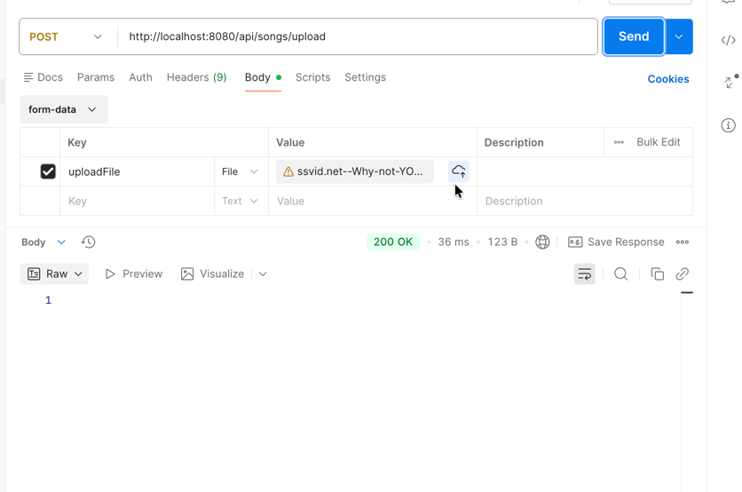
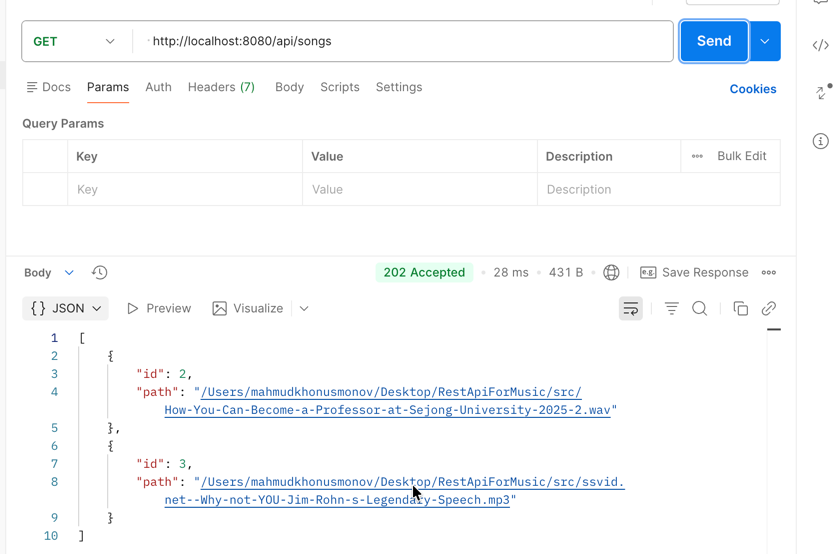
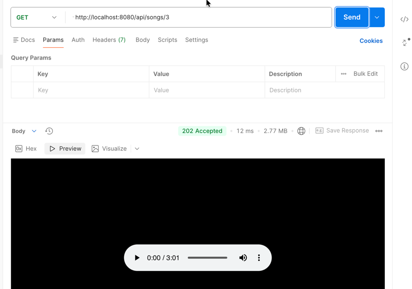
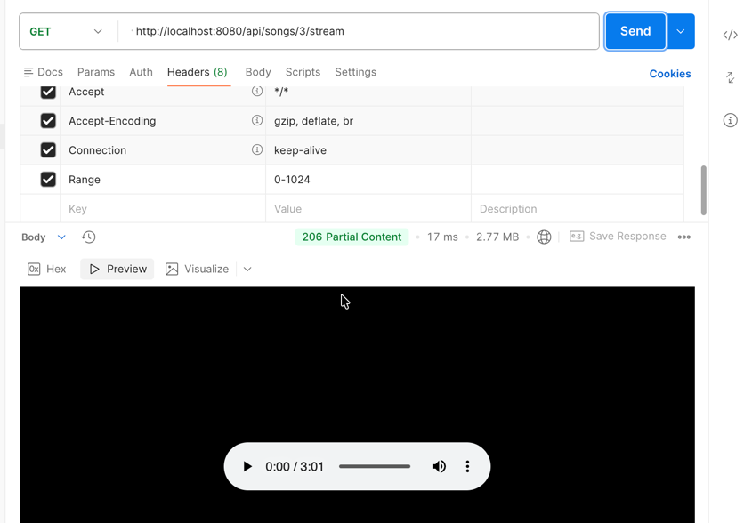
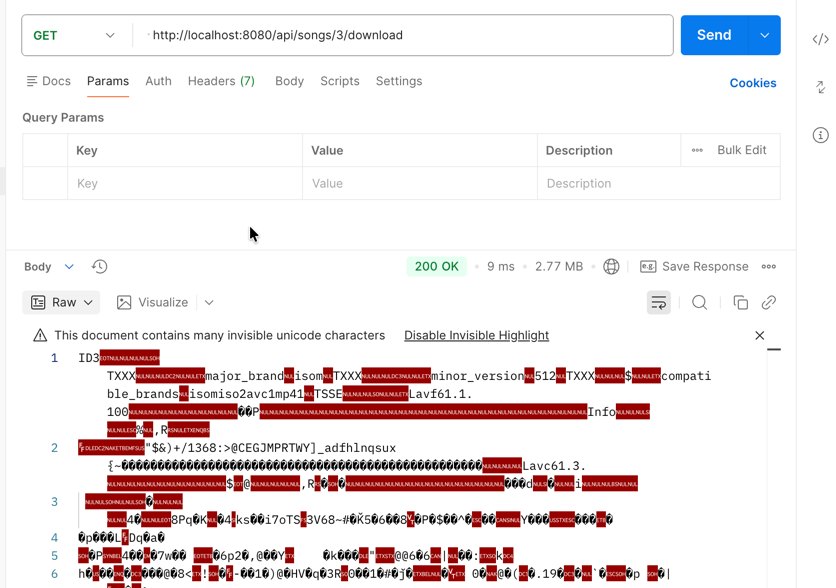
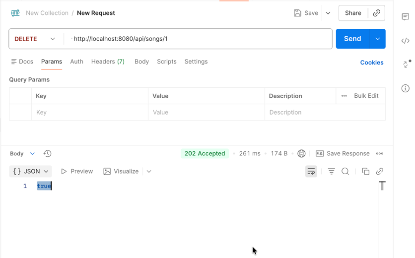

# RestApiForMusic

This project implements a RESTful API for managing and streaming music files using Java and Spring Boot. It provides endpoints for uploading, retrieving, streaming, downloading, and deleting audio files.

## Features

- **File Upload**: Upload music files directly to the server storage.
- **Data Persistence**: Stores file metadata (including file paths) in a database.
- **Audio Streaming**: Supports HTTP Range requests for efficient audio streaming playback.
- **File Retrieval**: Download files or retrieve them for inline playback.
- **Management**: List all available tracks or delete specific files.

## API Documentation

The following sections detail the available endpoints. Postman screenshots are included to demonstrate functionality.

### 1. Upload Music
**Endpoint**: `POST /api/songs/upload`
**Description**: Uploads a music file (multipart/form-data) to the server. The file is stored locally, and its metadata is saved to the database.

### 2. Get All Songs
**Endpoint**: `GET /api/songs`
**Description**: Retrieves a list of all music files stored in the database.

### 3. Get Song by ID
**Endpoint**: `GET /api/songs/{id}`
**Description**: Retrieves a specific song file by its unique ID. Returns the file resource for inline use.

### 4. Stream Song
**Endpoint**: `GET /api/songs/{id}/stream`
**Description**: Streams audio content for the specified song ID. This endpoint supports the `Range` header, allowing clients to request specific byte ranges for seeking and partial content delivery (HTTP 206).

### 5. Download Song
**Endpoint**: `GET /api/songs/{id}/download`
**Description**: Initiates a file download for the specified song ID.

### 6. Delete Song
**Endpoint**: `DELETE /api/songs/{id}`
**Description**: Removes the song record from the database. Note that this operation currently removes the database entry.

## Technologies Used

- **Java**: Core programming language.
- **Spring Boot**: Framework for building the REST API application.
- **Spring Web**: For building web, including RESTful, applications using Spring MVC.
- **Spring Data JPA**: For interaction with the database.

## References

The following resources were used in the development of this project and are recommended for further reading:

- [Building an Application with Spring Boot](https://spring.io/guides/gs/spring-boot/)
- [Building a RESTful Web Service](https://spring.io/guides/gs/rest-service/)
- [Uploading Files](https://spring.io/guides/gs/uploading-files/)
- [HTTP Range Requests (MDN)](https://developer.mozilla.org/en-US/docs/Web/HTTP/Range_requests)
